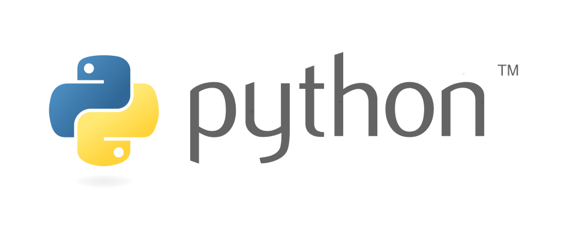

# Curso Python3

Python es un lenguaje de programación interpretado cuya filosofía hace hincapié en una sintaxis que favorezca un código legible.

Se trata de un lenguaje de programación multiparadigma, ya que soporta orientación a objetos, programación imperativa y, en menor medida, programación funcional. Es un lenguaje interpretado, usa tipado dinámico y es multiplataforma.

Los siguientes contenidos forman parte de un curso que he impartido para [OpenWebinars](https://openwebinars.net/cursos/python-3/) en mayo de 2017.

Puedes obtener todo el contenido del curso en el repositorio [GitHub](https://github.com/josedom24/curso_python3).
Todas las observaciones, mejoras y sugerncias son bienvenidas.

Mi nombre es Jośe Domingo Muñoz, y me puedes seguir en mí pagina web: [PLEDIN 2.0](https://www.josedomingo.org) y en twitter: [@pledin_jd](https://twitter.com/Pledin_JD).
